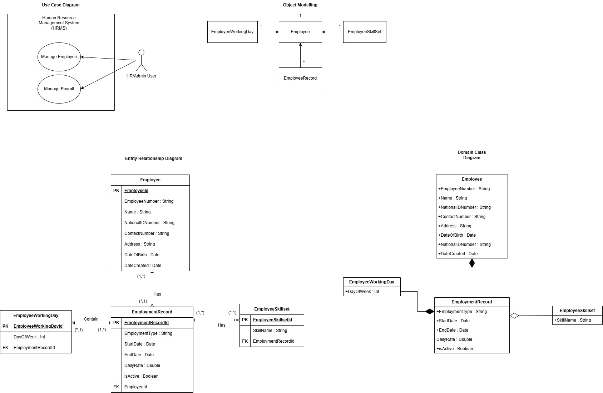

# 🏢 CDN HRMS Payroll System

[](https://dotnet.microsoft.com/)
[](https://reactjs.org/)
[](https://github.com/DapperLib/Dapper)
[](LICENSE)

> An HRMS built for Cendana Digital Network (CDN) to manage employee records and payroll, using Clean Architecture, CQRS, and Dapper with a full-stack .NET + React setup.

**Developed by:** Amri Azri  
**Live Demo:** [https://cdnhrms.vercel.app/cdn/hrms/login](https://cdnhrms.vercel.app/cdn/hrms/login)

> **Note:** Cendana Digital Network (CDN) is a fictional company used as context for this self-development project.

---

## 📋 Table of Contents

1. [Introduction](#-introduction)
2. [Tech Stack & Features](#-tech-stack--features)
3. [System Architecture](#-system-architecture)
4. [SDLC Documentation](#-sdlc-documentation)
5. [Technical Implementation](#-technical-implementation)
6. [Advanced Implementation](#-advanced-implementation)
7. [Setup & Installation](#-setup--installation)
8. [Usage Guide](#-usage-guide)
9. [Testing Documentation](#-testing-documentation)
10. [Deployment Guide](#-deployment-guide)
11. [Key Design Decisions](#-key-design-decisions)
12. [Known Limitations](#-known-limitations)
13. [Future Enhancements](#-future-enhancements)
14. [Conclusion](#-conclusion)
15. [Lessons Learned](#-lessons-learned)

---

## 📖 Introduction

Built for Cendana Digital Network (CDN), this system handles employee management, employment records, and payroll calculation. The backend uses .NET 8 with Clean Architecture and CQRS, Dapper for data access, and React on the frontend.

### Key Features

- ✅ Employee Management (CRUD operations with archive/unarchive)
- ✅ Employment Records Tracking (multiple records per employee)
- ✅ Intelligent Payroll Calculation (2× daily rate + birthday bonus)
- ✅ Wildcard Search (by employee number and name)
- ✅ JWT Authentication & Authorization
- ✅ Comprehensive Testing (44 unit tests + 13 integration tests)
- ✅ CI/CD Pipeline with GitHub Actions
- ✅ Production Deployment on AWS EC2 + Vercel

### Sample Data Examples

**Employee 1: Razak bin Osman**
```
Employee Number: RAZ-12340-10JAN1994
Daily Rate: RM 150.00
Working Days: Tuesday, Wednesday, Friday
Date Range: May 13-16, 2025
Take-Home Pay: RM 1,050.00 ✅
```

**Employee 2: Cheng Long**
```
Employee Number: CHE-00779-10SEP1994
Daily Rate: RM 100.00
Working Days: Tuesday, Thursday, Saturday
Date Range: September 1-9, 2025
Take-Home Pay: RM 800.00 ✅
```

---

## 🛠 Tech Stack & Features

**Backend:** ASP.NET Core (.NET 8), C#, Dapper, MediatR, FluentValidation, JWT, BCrypt, xUnit

**Frontend:** React 18, Vite, React Router v6, Axios, SCSS

**Infrastructure:** AWS EC2, AWS RDS (SQL Server), AWS ACM, Vercel, GitHub Actions

**Patterns:** Clean Architecture, CQRS, Repository Pattern, MediatR Pipeline

**Features implemented:**
- Employee CRUD with archive/unarchive (soft delete)
- Employment records per employee (multiple records, one active)
- Payroll calculation — 2× daily rate per working day + birthday bonus
- Wildcard search by employee number and name
- Server-side pagination
- JWT authentication
- 57 tests — 44 unit + 13 integration
- CI/CD via GitHub Actions → AWS EC2 + Vercel

---

## 🏗 System Architecture

### Clean Architecture Layers

```
┌─────────────────────────────────────────────────────────┐
│                 PRESENTATION LAYER                      │
│                    (HRMS.API)                           │
│  • Controllers (Auth, Employees, EmploymentRecords)     │
│  • GlobalExceptionMidlleware.cs                         │
│  • Program.cs (DI, Middleware, CORS, JWT)               │
│  • appsettings.json (Configuration)                     │
└───────────────────────┬─────────────────────────────────┘
                        │ depends on
┌───────────────────────▼─────────────────────────────────┐
│                 APPLICATION LAYER                       │
│                 (HRMS.Application)                      │
│  • Commands/ (CQRS Write Operations)                    │
│    └── CreateEmployee, UpdateEmployee, etc.             │
│  • Queries/ (CQRS Read Operations)                      │
│    └── GetEmployees, GetById, CalculateSalary           │
│  • Validators/ (FluentValidation)                       │
│  • Behaviors/ (MediatR Pipeline)                        │
│  • Interfaces/ (Service Contracts)                      │
│  • Services/ (AuthService, PayrollService)              │
└───────────────────────┬─────────────────────────────────┘
                        │ depends on
┌───────────────────────▼─────────────────────────────────┐
│                    DOMAIN LAYER                         │
│                   (HRMS.Domain)                         │
│  • Entities/ (DTOs for API)                             │
│    ├── Employee                                         │
│    ├── EmploymentRecord                                 │
│    ├── EmployeeWorkingDay                               │
│    ├── EmployeeSkillSet                                 │
│    └── User                                             │
│  • Common/ (Shared Domain Components)                   │
│    ├── ErrorResponse                                    │
│    ├── Exception                                        │
│    ├── pagedResult                                      │
│    └── PaginationParams                                 │
└───────────────────────┬─────────────────────────────────┘
                        │ implements
┌───────────────────────▼─────────────────────────────────┐
│              INFRASTRUCTURE LAYER                       │
│              (HRMS.Infrastructure)                      │
│  • Repositories/ (Dapper implementations)               │
│    ├── EmployeeRepository                               │
│    ├── EmploymentRecordRepository                       │
│    └── UserRepository                                   │
└─────────────────────────────────────────────────────────┘
```

**Key Principles:**
- **Dependency Inversion**: Dependencies point inward toward Domain
- **Separation of Concerns**: Each layer has single responsibility
- **Framework Independence**: Business logic independent of infrastructure
- **Testability**: Easy to mock dependencies for testing

### Database Schema

```
              ┌─────────────────┐
              │      Users      │
              ├─────────────────┤
              │ UserId (PK)     │
              │ Username        │
              │ PasswordHash    │
              │ CreatedAt       │
              │ IsActive        │
              └─────────────────┘

              ┌─────────────────┐
              │    Employees    │
              ├─────────────────┤
              │ EmployeeId (PK) │
              │ EmployeeNumber  │
              │ Name            │
              │ NationalNumber  │
              │ ContactNumber   │
              │ Position        │
              │ Address         │
              │ DateOfBirth     │
              │ DateCreated     │
              │ IsArchived      │
              └────────┬────────┘
                       │ 1:N
              ┌────────▼────────────┐
              │ EmploymentRecords   │
              ├─────────────────────┤
              │ EmploymentRecordId  │
              │ EmployeeId (FK)     │
              │ EmploymentType      │
              │ Position            │
              │ StartDate           │
              │ EndDate             │
              │ DailyRate           │
              │ IsActive            │
              └──────┬──────┬───────┘
                     │ 1:N  │ 1:N
        ┌────────────▼──┐   ┌──▼─────────────┐
        │ WorkingDays   │   │  SkillSets     │
        ├───────────────┤   ├────────────────┤
        │ WorkingDayId  │   │ SkillSetId     │
        │ RecordId (FK) │   │ RecordId (FK)  │
        │ DayOfWeek     │   │ SkillName      │
        └───────────────┘   └────────────────┘
```

---

## 📚 SDLC Documentation

## 📸 Initial Diagram



### 1. Requirements Analysis Phase

**Functional Requirements:**
- Employee CRUD operations with archive/unarchive
- Auto-generated employee numbers (ABC-12345-01JAN1990)
- Wildcard search by employee number and name
- Employment record management (multiple records per employee)
- Payroll calculation (2× daily rate + birthday bonus)
- JWT authentication and authorization

**Non-Functional Requirements:**
- Performance: API response time < 200ms
- Security: JWT tokens, BCrypt password hashing
- Scalability: Server-side pagination
- Maintainability: Clean Architecture, SOLID principles
- Testability: >90% test coverage

### 2. Design Phase

**Architecture Pattern:** Clean Architecture with CQRS
**Design Patterns Used:**
- CQRS (Command Query Responsibility Segregation)
- Repository Pattern
- MediatR Pipeline Pattern
- Dependency Injection

**Technology Stack Selection:**
- Backend: ASP.NET Core 8.0, Dapper ORM
- Frontend: React 18, Vite, SCSS
- Database: AWS RDS, SQL Server 2022
- Deployment: AWS EC2, Vercel
- CI/CD: GitHub Actions

### 3. Implementation Phase

- Phase 1: Backend API setup, Clean Architecture structure
- Phase 2: Domain entities, Dapper repositories
- Phase 3: CQRS commands/queries, FluentValidation
- Phase 4: Frontend React components, routing
- Phase 5: Integration, testing, bug fixes
- Phase 6: Deployment, CI/CD pipeline, documentation

**Code Quality Standards:**
- C# Coding Conventions
- SOLID Principles
- DRY (Don't Repeat Yourself)
- Meaningful naming conventions

### 4. Testing Phase

**Testing Strategy:**

**Unit Testing :**
- Handler Tests: CQRS command/query handlers
- Validator Tests: FluentValidation rules
- Service Tests: Business logic services
- Repository Tests: Data access methods

**Integration Testing:**
- Full API endpoint flow
- Database integration
- Authentication flow

**Test Coverage:** Application and Infrastructure layers

### 5. Deployment Phase

**Deployment Strategy:**
- **Backend**: AWS EC2 Windows Server with NSSM service
- **Frontend**: Vercel with serverless proxy
- **Database**: AWS RDS SQL Server
- **CI/CD**: Automated via GitHub Actions

**Deployment Steps:**
1. Code commit triggers GitHub Actions
2. Build and test pipeline runs
3. Publish .NET application
4. Deploy to EC2 via WinRM
5. Restart NSSM service
6. Vercel auto-deploys frontend

### 6. Maintenance Phase

**Monitoring:**
- Application logs via Serilog
- Server health monitoring
- Database performance metrics
- User activity tracking

**Support Plan:**
- Bug fix priority levels (Critical, High, Medium, Low)
- Regular security updates
- Performance optimization reviews
- User feedback incorporation

---

## 🔧 Technical Implementation

### CQRS Pattern with MediatR

**What is CQRS?**
CQRS (Command Query Responsibility Segregation) separates read operations (Queries) from write operations (Commands). This provides:
- Clear separation of concerns
- Optimized queries for reads
- Better scalability
- Easier testing

**How It Works:**

```csharp
// Command (Write Operation)
public record CreateEmployeeCommand : IRequest<Employee>
{
    public string Name { get; init; }
    public DateTime DateOfBirth { get; init; }
}

// Command Handler
public class CreateEmployeeCommandHandler 
    : IRequestHandler<CreateEmployeeCommand, Employee>
{
    public async Task<Employee> Handle(
        CreateEmployeeCommand request, 
        CancellationToken cancellationToken)
    {
        // Business logic here
        return createdEmployee;
    }
}

// Query (Read Operation)
public record GetEmployeeByIdQuery : IRequest<Employee>
{
    public Guid EmployeeId { get; init; }
}

// Query Handler
public class GetEmployeeByIdQueryHandler 
    : IRequestHandler<GetEmployeeByIdQuery, Employee>
{
    public async Task<Employee> Handle(
        GetEmployeeByIdQuery request, 
        CancellationToken cancellationToken)
    {
        return await _repository.GetByIdAsync(request.EmployeeId);
    }
}
```

**MediatR Pipeline:**
```
Request → MediatR → ValidationBehavior → Handler → Response
                         ↓
                  FluentValidation
```

### FluentValidation

**What is FluentValidation?**
A library for building strongly-typed validation rules using a fluent interface. Benefits:
- Declarative validation rules
- Reusable validators
- Separation from business logic
- Easy to test

**How It Works:**

```csharp
public class CreateEmployeeCommandValidator 
    : AbstractValidator<CreateEmployeeCommand>
{
    public CreateEmployeeCommandValidator()
    {
        RuleFor(x => x.Name)
            .NotEmpty()
            .WithMessage("Name is required")
            .MinimumLength(2)
            .MaximumLength(100);
        
        RuleFor(x => x.NationalNumber)
            .NotEmpty()
            .Matches(@"^\d{6}-\d{2}-\d{4}$")
            .WithMessage("Format must be YYMMDD-XX-XXXX");
        
        RuleFor(x => x.DateOfBirth)
            .Must(BeAtLeast18YearsOld)
            .WithMessage("Employee must be 18 or older");
    }
    
    private bool BeAtLeast18YearsOld(DateTime dob)
    {
        var age = DateTime.Today.Year - dob.Year;
        if (dob.Date > DateTime.Today.AddYears(-age)) age--;
        return age >= 18;
    }
}
```

**Automatic Validation via Pipeline:**
```csharp
public class ValidationBehavior<TRequest, TResponse> 
    : IPipelineBehavior<TRequest, TResponse>
{
    public async Task<TResponse> Handle(...)
    {
        var failures = _validators
            .Select(v => v.Validate(request))
            .SelectMany(r => r.Errors)
            .Where(f => f != null)
            .ToList();
        
        if (failures.Any())
        {
            throw new ValidationException(failures);
        }
        
        return await next();
    }
}
```

### Payroll Calculation Algorithm

```csharp
public async Task<SalaryCalculationResult> CalculateSalaryAsync(
    Guid employeeId, DateTime startDate, DateTime endDate)
{
    var employee = await _employeeRepository.GetByIdAsync(employeeId);
    var activeRecord = await _employmentRecordRepository
                             .GetActiveByEmployeeIdAsync(employeeId);
    
    decimal totalPay = 0;
    
    // Loop through each day in date range
    for (var date = startDate; date <= endDate; date = date.AddDays(1))
    {
        // Working day: 2× daily rate
        if (activeRecord.WorkingDays.Any(wd => wd.DayOfWeek == date.DayOfWeek))
        {
            totalPay += activeRecord.DailyRate * 2;
        }
        
        // Birthday: +1× daily rate (regardless of working day)
        if (date.Month == employee.DateOfBirth.Month && 
            date.Day == employee.DateOfBirth.Day)
        {
            totalPay += activeRecord.DailyRate;
        }
    }
    
    return new SalaryCalculationResult
    {
        TakeHomePay = totalPay,
        Currency = "MYR"
    };
}
```

---

## ⚡ Advanced Implementation

### 1. MediatR Pipeline Behaviors

Requests pass through a pipeline before reaching their handler. Used here for automatic validation — any command or query is validated by FluentValidation before the handler runs.

```csharp
public class ValidationBehavior<TRequest, TResponse>
    : IPipelineBehavior<TRequest, TResponse>
{
    private readonly IEnumerable<IValidator<TRequest>> _validators;

    public async Task<TResponse> Handle(
        TRequest request,
        RequestHandlerDelegate<TResponse> next,
        CancellationToken cancellationToken)
    {
        var failures = _validators
            .Select(v => v.Validate(request))
            .SelectMany(r => r.Errors)
            .Where(f => f != null)
            .ToList();

        if (failures.Any())
            throw new ValidationException(failures);

        return await next();
    }
}
```

Pipeline flow:
```
Request → ValidationBehavior → Handler → Response
```

---

### 2. FluentValidation Pipeline Integration

Validators are registered and automatically picked up by the pipeline behavior above — no manual validation calls in handlers.

```csharp
public class CreateEmployeeCommandValidator
    : AbstractValidator<CreateEmployeeCommand>
{
    public CreateEmployeeCommandValidator()
    {
        RuleFor(x => x.Name)
            .NotEmpty()
            .MinimumLength(2)
            .MaximumLength(100);

        RuleFor(x => x.NationalNumber)
            .NotEmpty()
            .Matches(@"^\d{6}-\d{2}-\d{4}$")
            .WithMessage("Format must be YYMMDD-XX-XXXX");

        RuleFor(x => x.DateOfBirth)
            .Must(dob => {
                var age = DateTime.Today.Year - dob.Year;
                if (dob.Date > DateTime.Today.AddYears(-age)) age--;
                return age >= 18;
            })
            .WithMessage("Employee must be at least 18 years old");
    }
}
```

---

### 3. Global Exception Middleware

Catches all unhandled exceptions in one place and returns a consistent error response shape.

```csharp
public class GlobalExceptionMiddleware
{
    private readonly RequestDelegate _next;

    public async Task InvokeAsync(HttpContext context)
    {
        try
        {
            await _next(context);
        }
        catch (ValidationException ex)
        {
            context.Response.StatusCode = 400;
            await context.Response.WriteAsJsonAsync(new ErrorResponse
            {
                StatusCode = 400,
                Message = "Validation failed",
                Detail = string.Join(", ", ex.Errors.Select(e => e.ErrorMessage))
            });
        }
        catch (NotFoundException ex)
        {
            context.Response.StatusCode = 404;
            await context.Response.WriteAsJsonAsync(new ErrorResponse
            {
                StatusCode = 404,
                Message = ex.Message
            });
        }
        catch (Exception)
        {
            context.Response.StatusCode = 500;
            await context.Response.WriteAsJsonAsync(new ErrorResponse
            {
                StatusCode = 500,
                Message = "An unexpected error occurred"
            });
        }
    }
}
```

All error responses follow the same shape:
```json
{
  "statusCode": 400,
  "message": "Validation failed",
  "detail": "Name is required",
  "timestamp": "2025-02-14T10:30:00Z"
}
```

---

### 4. JWT + BCrypt Auth Flow

Passwords are hashed with BCrypt on registration and verified on login. A JWT is issued and must be included in all protected requests.

```csharp
// Registration — hash password before storing
public async Task<User> RegisterAsync(string username, string password)
{
    var passwordHash = BCrypt.Net.BCrypt.HashPassword(password);
    var user = new User { Username = username, PasswordHash = passwordHash };
    await _userRepository.CreateAsync(user);
    return user;
}

// Login — verify hash, issue JWT
public async Task<string> LoginAsync(string username, string password)
{
    var user = await _userRepository.GetByUsernameAsync(username);
    if (user == null || !BCrypt.Net.BCrypt.Verify(password, user.PasswordHash))
        throw new UnauthorizedException("Invalid credentials");

    return GenerateJwtToken(user);
}

private string GenerateJwtToken(User user)
{
    var claims = new[] { new Claim(ClaimTypes.Name, user.Username) };
    var key = new SymmetricSecurityKey(Encoding.UTF8.GetBytes(_jwtSettings.Key));
    var token = new JwtSecurityToken(
        issuer: _jwtSettings.Issuer,
        audience: _jwtSettings.Audience,
        claims: claims,
        expires: DateTime.UtcNow.AddMinutes(_jwtSettings.ExpiryMinutes),
        signingCredentials: new SigningCredentials(key, SecurityAlgorithms.HmacSha256)
    );
    return new JwtSecurityTokenHandler().WriteToken(token);
}
```

---

### 5. Decorator Pattern — Cached Repository

A caching layer wraps the real repository without modifying it. Disabled in production to ensure data consistency, but the implementation exists.

```csharp
public class CachedEmployeeRepository : IEmployeeRepository
{
    private readonly IEmployeeRepository _inner;
    private readonly ICacheService _cache;
    private const string CacheKey = "employees";

    public CachedEmployeeRepository(IEmployeeRepository inner, ICacheService cache)
    {
        _inner = inner;
        _cache = cache;
    }

    public async Task<IEnumerable<Employee>> GetAllAsync()
    {
        var cached = await _cache.GetAsync<IEnumerable<Employee>>(CacheKey);
        if (cached != null) return cached;

        var result = await _inner.GetAllAsync();
        await _cache.SetAsync(CacheKey, result, TimeSpan.FromMinutes(5));
        return result;
    }

    // Write operations delegate directly and invalidate cache
    public async Task<Employee> CreateAsync(Employee employee)
    {
        var result = await _inner.CreateAsync(employee);
        await _cache.RemoveAsync(CacheKey);
        return result;
    }
}
```

Registered via DI:
```csharp
services.AddScoped<IEmployeeRepository, EmployeeRepository>();
services.Decorate<IEmployeeRepository, CachedEmployeeRepository>();
```

---

### 6. Vercel Serverless Proxy

The frontend is hosted on Vercel but the backend runs on AWS EC2. A serverless function on Vercel proxies all API requests to EC2, handling CORS and forwarding the JWT header.

```javascript
// api/[...all].js
export default async function handler(req, res) {
    res.setHeader("Access-Control-Allow-Origin", "*");
    res.setHeader("Access-Control-Allow-Methods", "GET, POST, PUT, DELETE, OPTIONS");
    res.setHeader("Access-Control-Allow-Headers", "Content-Type, Authorization");

    if (req.method === "OPTIONS") return res.status(200).end();

    const path = req.url.replace("/api/", "");
    const backendUrl = `https://<ec2-host>:5001/api/${path}`;

    const headers = { "Content-Type": "application/json" };
    if (req.headers.authorization) {
        headers["Authorization"] = req.headers.authorization;
    }

    const response = await fetch(backendUrl, {
        method: req.method,
        headers,
        body: req.method !== "GET" ? JSON.stringify(req.body) : undefined,
    });

    const data = await response.json();
    return res.status(response.status).json(data);
}
```

This keeps the EC2 backend private — only Vercel communicates with it directly.

---

### 7. CI/CD Pipeline — GitHub Actions

Every push to `main` triggers a workflow that builds, tests, and deploys. Deployment is blocked if any test fails.

```
git push origin main
        │
        ▼
┌──────────────────────────────────┐
│         GitHub Actions           │
│                                  │
│  1. dotnet restore               │
│  2. dotnet build                 │
│  3. dotnet test ── fail? stop.   │
│  4. dotnet publish               │
│  5. Copy to EC2 via WinRM        │
│  6. Restart NSSM service         │
└──────────────────────────────────┘
        │
        ▼
  Vercel auto-deploys frontend on same push
```

```yaml
- name: Test
  run: dotnet test --no-build -c Release

- name: Deploy to EC2
  if: success()
  run: |
    Invoke-Command -ScriptBlock { nssm stop HRMS }
    Copy-Item publish/* C:\inetpub\HRMS\ -Recurse -Force
    Invoke-Command -ScriptBlock { nssm start HRMS }
```

---

## ⚙️ Setup & Installation

### Prerequisites

```bash
# Required Software
✅ .NET 8.0 SDK
✅ Node.js 18+
✅ SQL Server 2022 / Express
✅ Git
✅ Visual Studio 2022 / VS Code (recommended)
```

### Backend Setup

#### 1. Clone Repository

```bash
git clone https://github.com/amriazri89/CDN-HRMS-Code.git
cd HRMS-Payroll
```

#### 2. Configure Database

**Update `HRMS.API/appsettings.json`:**

```json
{
  "ConnectionStrings": {
    "DefaultConnection": "Server=localhost;Database=HRMSDb;Trusted_Connection=True;TrustServerCertificate=True;"
  },
  "Jwt": {
    "Key": "YourSuperSecretKeyThatIsAtLeast32CharactersLong!",
    "Issuer": "HRMSApi",
    "Audience": "HRMSClient",
    "ExpiryMinutes": 480
  }
}
```

#### 3. Create Database

Run the following SQL scripts in order against your SQL Server instance.

**Step 1 — Create the database:**
```sql
CREATE DATABASE HRMSDb;
GO

USE HRMSDb;
GO
```

**Step 2 — Create tables:**
```sql
CREATE TABLE Users (
    UserId        UNIQUEIDENTIFIER PRIMARY KEY DEFAULT NEWID(),
    Username      NVARCHAR(100)    NOT NULL UNIQUE,
    PasswordHash  NVARCHAR(255)    NOT NULL,
    CreatedAt     DATETIME2        NOT NULL DEFAULT GETUTCDATE(),
    IsActive      BIT              NOT NULL DEFAULT 1
);

CREATE TABLE Employees (
    EmployeeId      UNIQUEIDENTIFIER PRIMARY KEY DEFAULT NEWID(),
    EmployeeNumber  NVARCHAR(50)     NOT NULL UNIQUE,
    Name            NVARCHAR(100)    NOT NULL,
    NationalNumber  NVARCHAR(20)     NOT NULL UNIQUE,
    ContactNumber   NVARCHAR(20)     NOT NULL,
    Position        NVARCHAR(100)    NOT NULL,
    Address         NVARCHAR(255)    NOT NULL,
    DateOfBirth     DATE             NOT NULL,
    DateCreated     DATETIME2        NOT NULL DEFAULT GETUTCDATE(),
    IsArchived      BIT              NOT NULL DEFAULT 0
);

CREATE TABLE EmploymentRecords (
    EmploymentRecordId  UNIQUEIDENTIFIER PRIMARY KEY DEFAULT NEWID(),
    EmployeeId          UNIQUEIDENTIFIER NOT NULL REFERENCES Employees(EmployeeId),
    EmploymentType      NVARCHAR(50)     NOT NULL,
    Position            NVARCHAR(100)    NOT NULL,
    StartDate           DATE             NOT NULL,
    EndDate             DATE             NULL,
    DailyRate           DECIMAL(10, 2)   NOT NULL,
    IsActive            BIT              NOT NULL DEFAULT 0
);

CREATE TABLE EmployeeWorkingDays (
    WorkingDayId        UNIQUEIDENTIFIER PRIMARY KEY DEFAULT NEWID(),
    EmploymentRecordId  UNIQUEIDENTIFIER NOT NULL REFERENCES EmploymentRecords(EmploymentRecordId),
    DayOfWeek           INT              NOT NULL  -- 0=Sun, 1=Mon, ..., 6=Sat
);

CREATE TABLE EmployeeSkillSets (
    SkillSetId          UNIQUEIDENTIFIER PRIMARY KEY DEFAULT NEWID(),
    EmploymentRecordId  UNIQUEIDENTIFIER NOT NULL REFERENCES EmploymentRecords(EmploymentRecordId),
    SkillName           NVARCHAR(100)    NOT NULL
);
```

**Step 3 — Seed default admin user:**
```sql
-- Password: Admin@123 (BCrypt hashed)
INSERT INTO Users (Username, PasswordHash)
VALUES (
    'admin',
    '$2a$11$hashed_value_here'
);
```

> **Note:** Generate the BCrypt hash for `Admin@123` using the app's register endpoint (`POST /Auth/register`) or a BCrypt tool, then insert manually.

#### 4. Build and Run

```bash
# Restore packages
dotnet restore

# Build
dotnet build

# Run
dotnet run --project HRMS.API

# Output:
# Now listening on: http://localhost:5000
# Now listening on: https://localhost:5001
```

### Frontend Setup

#### 1. Navigate to Frontend

```bash
cd HRMS.Frontend/react-app
```

#### 2. Install Dependencies

```bash
npm install
npm install uuid  # Required for GUID generation
```

#### 3. Configure Vite Proxy

**Create/Edit `vite.config.js`:**

```javascript
import { defineConfig } from 'vite'
import react from '@vitejs/plugin-react'

export default defineConfig({
  plugins: [react()],
  server: {
    port: 5173,
    proxy: {
      '/api': {
        target: 'http://localhost:5000',
        changeOrigin: true,
        secure: false,
      }
    }
  }
})
```

#### 4. Run Development Server

```bash
npm run dev

# Output:
# ➜  Local:   http://localhost:5173/
```

### Default Credentials

```
Username: admin
Password: Admin@123
```

---

## 📖 Usage Guide (Local)


## 📚 API Usage

### Base URL
```
https://localhost:5001/api
```

### Authentication

All protected endpoints require a JWT token in the Authorization header:

```
Authorization: Bearer <your-jwt-token>
```

### Endpoints

#### Authentication

| Method | Endpoint | Description | Auth Required |
|--------|----------|-------------|---------------|
| POST | `/Auth/register` | Register new user | ❌ |
| POST | `/Auth/login` | Login and get JWT token | ❌ |

**Login Request:**
```json
{
  "username": "admin",
  "password": "Admin@123"
}
```

**Login Response:**
```json
{
  "token": "eyJhbGciOiJIUzI1NiIsInR5cCI6IkpXVCJ9...",
  "username": "admin",
  "expiresIn": 3600
}
```

#### Employees

| Method | Endpoint | Description | Auth Required |
|--------|----------|-------------|---------------|
| GET | `/Employees` | Get all employees | ✅ |
| GET | `/Employees/{id}` | Get employee by ID | ✅ |
| GET | `/Employees/search?keyword={term}` | Search employees | ✅ |
| GET | `/Employees/paged` | Get paginated employees | ✅ |
| POST | `/Employees` | Create employee | ✅ |
| PUT | `/Employees/{id}` | Update employee | ✅ |
| DELETE | `/Employees/{id}` | Delete employee | ✅ |
| POST | `/Employees/{id}/archive` | Archive employee | ✅ |
| POST | `/Employees/{id}/unarchive` | Unarchive employee | ✅ |
| POST | `/Employees/{id}/calculate-salary` | Calculate salary | ✅ |

**Create Employee Request:**
```json
{
  "name": "Ahmad Ali",
  "nationalNumber": "950315-01-5678",
  "contactNumber": "+60123456789",
  "position": "Senior Developer",
  "address": "Kuala Lumpur, Malaysia",
  "dateOfBirth": "1995-03-15"
}
```

**Calculate Salary Request:**
```
POST /Employees/{id}/calculate-salary?startDate=2025-02-10&endDate=2025-02-14
```

**Calculate Salary Response:**
```json
{
  "employeeId": "guid",
  "startDate": "2025-02-10T00:00:00",
  "endDate": "2025-02-14T00:00:00",
  "takeHomePay": 900.00,
  "currency": "MYR"
}
```

#### Employment Records

| Method | Endpoint | Description | Auth Required |
|--------|----------|-------------|---------------|
| GET | `/EmploymentRecords/employee/{id}` | Get all records for employee | ✅ |
| GET | `/EmploymentRecords/employee/{id}/active` | Get active record | ✅ |
| GET | `/EmploymentRecords/{id}` | Get record by ID | ✅ |
| POST | `/EmploymentRecords` | Create employment record | ✅ |
| PUT | `/EmploymentRecords/{id}` | Update record | ✅ |
| DELETE | `/EmploymentRecords/{id}` | Delete record | ✅ |
| POST | `/EmploymentRecords/{id}/activate` | Activate record | ✅ |
| POST | `/EmploymentRecords/{id}/deactivate` | Deactivate record | ✅ |

**Create Employment Record Request:**
```json
{
  "employeeId": "guid",
  "employmentType": "Permanent",
  "position": "Senior Developer",
  "startDate": "2024-01-01",
  "endDate": null,
  "dailyRate": 150.00,
  "workingDays": [1, 3, 5],
  "skillSets": ["C#", "SQL Server", "ReactJs"]
}
```

### Pagination

Paginated endpoints support the following query parameters:

| Parameter | Type | Default | Description |
|-----------|------|---------|-------------|
| `pageNumber` | int | 1 | Page number to retrieve |
| `pageSize` | int | 10 | Items per page (max 100) |
| `searchTerm` | string | - | Search keyword |
| `sortBy` | string | "Name" | Sort field |
| `sortDescending` | bool | false | Sort direction |

**Example:**
```
GET /Employees/paged?pageNumber=1&pageSize=25&searchTerm=Ahmad&sortBy=Name
```

**Response Headers:**
```
X-Pagination: {
  "totalCount": 100,
  "pageSize": 25,
  "pageNumber": 1,
  "totalPages": 4
}
```

### Error Responses

All errors follow a consistent format:

```json
{
  "statusCode": 400,
  "message": "Validation failed",
  "detail": "Name is required",
  "timestamp": "2025-02-14T10:30:00Z"
}
```

**HTTP Status Codes:**

| Code | Description |
|------|-------------|
| 200 | Success |
| 201 | Created |
| 400 | Bad Request |
| 401 | Unauthorized |
| 403 | Forbidden |
| 404 | Not Found |
| 500 | Internal Server Error |

---

## 📚 System Usage

### 1. Login

1. Navigate to [https://cdnhrms.vercel.app/cdn/hrms/login](https://cdnhrms.vercel.app/cdn/hrms/login)
2. Enter credentials (admin / Admin@123)
3. JWT token stored in localStorage
4. Redirected to Dashboard

### 2. Dashboard

- View total employees (active/archived)
- Recent employee additions
- Upcoming birthdays (30 days)
- Quick navigation links

### 3. Employee Management

**View Employees:**
- Navigate to Employees page
- Use search bar for wildcard search
- Sort by any column
- Pagination controls at bottom

**Add Employee:**
1. Click "Add Employee" button
2. Fill in required fields:
   - Name (min 2 characters)
   - National Number (YYMMDD-XX-XXXX format)
   - Contact Number (+60XXXXXXXXX format)
   - Position
   - Address
   - Date of Birth
3. Employee number auto-generated
4. Submit form

**Edit Employee:**
1. Click edit icon on employee row
2. Modal opens with pre-filled data
3. Modify fields
4. Save changes

**Archive/Unarchive:**
- Click archive/unarchive button
- Confirmation modal appears
- Archived employees hidden by default
- Toggle "Show Archived" to view

### 4. Employment Records

**View Records:**
1. Click on employee row
2. "View Records" button
3. Modal shows all employment records
4. Active record highlighted in green

**Add Record:**
1. Click "Add Employment Record"
2. Fill in:
   - Employment Type (Permanent/Contract)
   - Position
   - Start Date / End Date
   - Daily Rate
   - Working Days (checkboxes)
   - Skills (comma-separated)
3. Submit

**Activate/Deactivate:**
- Only one record can be active per employee
- Click activate button
- Previous active record auto-deactivated

### 5. Payroll Calculation

1. Select employee
2. Click "Calculate Salary" button
3. Select date range
4. Click "Calculate"
5. View breakdown:
   - Working days count
   - Working days pay (2× daily rate)
   - Birthday bonus (if applicable)
   - Total take-home pay

---

## 🧪 Testing Documentation

### Testing Pyramid Strategy

This project follows the **Testing Pyramid** approach:

```
        🔺 E2E Tests (10%)
      🔺🔺 Integration Tests (20%)
    🔺🔺🔺 Unit Tests (70%)
```

**Benefits:**
- Fast feedback loop (unit tests run in seconds)
- High confidence in business logic
- Cost-effective maintenance
- Reliable CI/CD pipeline


### Unit Tests (44 tests)

**Testing Framework:**
- **xUnit** - Test runner
- **Moq** - Mocking framework
- **FluentAssertions** - Readable assertions

**What I Test:**

**1. CQRS Handlers (10 tests)**
```csharp
// Example: CreateEmployeeCommandHandler
[Fact]
public async Task Handle_ValidCommand_ReturnsEmployeeWithGeneratedNumber()
{
    // Arrange
    var mockRepo = new Mock<IEmployeeRepository>();
    var command = new CreateEmployeeCommand 
    { 
        Name = "Ahmad Ali",
        DateOfBirth = new DateTime(1990, 1, 1)
    };
    
    // Act
    var result = await _handler.Handle(command, default);
    
    // Assert
    result.Should().NotBeNull();
    result.EmployeeNumber.Should().MatchRegex(@"AHM-\d{5}-01JAN1990");
    mockRepo.Verify(x => x.CreateAsync(It.IsAny<Employee>()), Times.Once);
}
```

**Tests Include:**
- CreateEmployeeCommandHandler (success, validation failure)
- UpdateEmployeeCommandHandler (success, not found)
- GetEmployeeByIdQueryHandler (found, not found)
- CalculateSalaryQueryHandler (with birthday, without birthday)
- CreateEmploymentRecordCommandHandler (success, validation)

**2. FluentValidation Rules (12 tests)**
```csharp
// Example: Name Validation
[Theory]
[InlineData("")] // Empty
[InlineData("A")] // Too short
[InlineData("AB123")] // Contains numbers
public void Name_Invalid_ShouldFail(string name)
{
    // Arrange
    var validator = new CreateEmployeeCommandValidator();
    var command = new CreateEmployeeCommand { Name = name };
    
    // Act
    var result = validator.Validate(command);
    
    // Assert
    result.IsValid.Should().BeFalse();
    result.Errors.Should().Contain(e => e.PropertyName == "Name");
}

[Fact]
public void NationalNumber_ValidFormat_ShouldPass()
{
    // Format: YYMMDD-XX-XXXX
    var command = new CreateEmployeeCommand 
    { 
        NationalNumber = "940110-01-5678" 
    };
    
    var result = _validator.Validate(command);
    
    result.Errors.Should().NotContain(e => 
        e.PropertyName == nameof(command.NationalNumber));
}
```

**Tests Include:**
- Name validation (required, length, format)
- National Number validation (format YYMMDD-XX-XXXX)
- Contact Number validation (Malaysian format +60XXXXXXXXX)
- Date of Birth validation (minimum age 18)
- Daily Rate validation (must be > 0)
- Working Days validation (no duplicates)

**3. Business Logic Services (6 tests)**
```csharp
// Example: Payroll Calculation
[Fact]
public async Task CalculateSalary_WithBirthday_IncludesBirthdayBonus()
{
    // Arrange
    var employee = CreateTestEmployee(dateOfBirth: new DateTime(1994, 5, 14));
    var activeRecord = CreateTestRecord(dailyRate: 150m, workingDays: [2, 3, 5]);
    
    // Act: Date range includes birthday
    var result = await _payrollService.CalculateSalaryAsync(
        employee.EmployeeId, 
        new DateTime(2025, 5, 13), 
        new DateTime(2025, 5, 16)
    );
    
    // Assert
    result.TakeHomePay.Should().Be(1050m); // 900 + 150 birthday bonus
}

[Fact]
public async Task CalculateSalary_WithoutBirthday_NoBonus()
{
    // Birthday outside range
    var result = await _payrollService.CalculateSalaryAsync(...);
    
    result.TakeHomePay.Should().Be(800m); // No birthday bonus
}
```

**Tests Include:**
- Payroll calculation with birthday bonus
- Payroll calculation without birthday
- Working days calculation
- Date range validation
- Active employment record check

**What I Don't Unit Test:**
- ❌ Database queries (tested in integration tests)
- ❌ Framework code (ASP.NET, Dapper)
- ❌ Third-party libraries
- ❌ Infrastructure layer implementations

### Integration Tests (13 tests)

**Testing Framework:**
- **WebApplicationFactory** - In-memory test server
- **xUnit** - Test runner
- **FluentAssertions** - Assertions

**What I Test:**

**Full HTTP Request Flow:**
```csharp
public class EmployeesControllerIntegrationTests 
    : IClassFixture<HrmsWebApplicationFactory>
{
    private readonly HttpClient _client;
    
    [Fact]
    public async Task CreateEmployee_ValidData_Returns201Created()
    {
        // Arrange: Get JWT token
        var token = await GetTokenAsync();
        _client.DefaultRequestHeaders.Authorization = 
            new AuthenticationHeaderValue("Bearer", token);
        
        var employee = new
        {
            name = "Ahmad Ali",
            nationalNumber = "950315-01-5678",
            contactNumber = "+60123456789",
            position = "Developer",
            address = "Kuala Lumpur",
            dateOfBirth = "1995-03-15"
        };
        
        // Act
        var response = await _client.PostAsJsonAsync("/api/employees", employee);
        
        // Assert
        response.StatusCode.Should().Be(HttpStatusCode.Created);
        var result = await response.Content.ReadFromJsonAsync<Employee>();
        result.EmployeeNumber.Should().MatchRegex(@"AHM-\d{5}-15MAR1995");
    }
}
```

**Tests Include:**

**1. Authentication (2 tests)**
- GET /api/employees without token → 401 Unauthorized
- POST /api/employees without token → 401 Unauthorized

**2. Employee CRUD (6 tests)**
- Create employee with valid data → 201 Created
- Create employee under 18 → 400 Bad Request (validation error)
- Create employee empty name → 400 Bad Request
- Get employee by ID → 200 OK
- Get non-existent employee → 404 Not Found
- Search employees by keyword → 200 OK

**3. Employment Records (3 tests)**
- Create employment record valid data → 201 Created
- Create employment record negative rate → 400 Bad Request
- Get employment records by employee → 200 OK

**4. End-to-End Flow (2 tests)**
- Create employee then get by ID → Data persists
- Create employment record then get by employee → Record retrieved

**Test Configuration:**
```csharp
public class HrmsWebApplicationFactory : WebApplicationFactory<Program>
{
    protected override void ConfigureWebHost(IWebHostBuilder builder)
    {
        builder.UseEnvironment("Development");
        
        builder.ConfigureServices(services =>
        {
            // Use in-memory cache for tests
            services.AddMemoryCache();
            services.AddSingleton<ICacheService, InMemoryCacheService>();
        });
    }
}
```

### Running Tests

```bash
# Run all tests
dotnet test

# Run specific test project
dotnet test HRMS.Tests/HRMS.UnitTests
dotnet test HRMS.Tests/HRMS.IntegrationTests

# Run with code coverage
dotnet test /p:CollectCoverage=true /p:CoverageReportsFormat=lcov

# Verbose output
dotnet test --logger "console;verbosity=detailed"

# Filter by category
dotnet test --filter "Category=UnitTest"
dotnet test --filter "Category=Integration"
```

### Test Best Practices Applied

✅ **Arrange-Act-Assert (AAA) Pattern**
```csharp
// Arrange: Setup test data
var command = new CreateEmployeeCommand { ... };

// Act: Execute the operation
var result = await _handler.Handle(command);

// Assert: Verify the result
result.Should().NotBeNull();
```

✅ **Test Naming Convention**
```
MethodName_StateUnderTest_ExpectedBehavior

Examples:
- Handle_ValidCommand_ReturnsEmployee
- Handle_InvalidName_ThrowsValidationException
- CalculateSalary_WithBirthday_IncludesBonus
```

✅ **Mock Only External Dependencies**
```csharp
// ✅ Mock repository (external dependency)
var mockRepo = new Mock<IEmployeeRepository>();

// ❌ Don't mock domain entities or value objects
// Test them directly
```

✅ **Test One Thing Per Test**
```csharp
// ✅ Good - Tests one validation rule
[Fact]
public void Name_Empty_ShouldFail() { }

[Fact]
public void Name_TooShort_ShouldFail() { }

// ❌ Bad - Tests multiple things
[Fact]
public void Name_AllValidations_ShouldFail() { }
```

### CI/CD Integration

Tests run automatically on every commit via GitHub Actions:

```yaml
- name: Run Unit Tests
  run: dotnet test HRMS.Tests/HRMS.UnitTests --no-build -c Release
  
- name: Run Integration Tests
  run: dotnet test HRMS.Tests/HRMS.IntegrationTests --no-build -c Release
  
- name: Deployment Only If Tests Pass
  if: success()
  run: |
    # Deployment steps...
```

**Result:** No deployment if any test fails, ensuring production quality.

---

## 🚀 Deployment Guide

### AWS EC2 Setup (Backend)

#### Server Configuration

**Specifications:**
- OS: Windows Server 2022
- Instance Type: t3.medium
- .NET Runtime: 8.0
- Service Manager: NSSM

#### Deployment Steps

**1. Publish Application:**

```bash
dotnet publish HRMS.API -c Release -o publish
```

**2. Copy to EC2:**

```powershell
# Using WinRM or Remote Desktop
# Copy publish folder to: C:\inetpub\HRMS\
```

**3. Install NSSM Service:**

```powershell
# Download NSSM from https://nssm.cc/download

# Install service
nssm install HRMS "C:\inetpub\HRMS\HRMS.API.exe"
nssm set HRMS AppDirectory "C:\inetpub\HRMS"
nssm set HRMS DisplayName "HRMS API"
nssm set HRMS Start SERVICE_AUTO_START

# Start service
nssm start HRMS

# Verify
nssm status HRMS
```

**4. Configure Firewall:**

```powershell
# Open port 5001 for HTTPS
New-NetFirewallRule -DisplayName "HRMS HTTPS" `
  -Direction Inbound `
  -LocalPort 5001 `
  -Protocol TCP `
  -Action Allow
```

### Vercel Setup (Frontend)

#### Configuration

**1. Create Vercel Account:**
- Sign up at vercel.com
- Connect GitHub repository

**2. Configure Build Settings:**
```json
{
  "buildCommand": "npm run build",
  "outputDirectory": "dist",
  "framework": "vite"
}
```

**3. Create Serverless Proxy:**

**File: `api/[...all].js`**

```javascript
import https from 'https';

const agent = new https.Agent({ rejectUnauthorized: false });

export default async function handler(req, res) {
  res.setHeader('Access-Control-Allow-Origin', '*');
  res.setHeader('Access-Control-Allow-Methods', 'GET, POST, PUT, DELETE, OPTIONS');
  res.setHeader('Access-Control-Allow-Headers', 'Content-Type, Authorization');
  
  if (req.method === 'OPTIONS') {
    return res.status(200).end();
  }

  const path = req.url.replace('/api/', '');
  const backendUrl = `https://ec2-35-172-146-76.compute-1.amazonaws.com:5001/api/${path}`;

  try {
    const headers = { 'Content-Type': 'application/json' };
    if (req.headers.authorization) {
      headers['Authorization'] = req.headers.authorization;
    }

    const response = await fetch(backendUrl, {
      method: req.method,
      headers: headers,
      body: req.method !== 'GET' ? JSON.stringify(req.body) : undefined,
      agent: agent,
    });

    const data = await response.json();
    return res.status(response.status).json(data);
  } catch (error) {
    return res.status(500).json({ error: error.message });
  }
}
```

**4. Deploy:**

```bash
# Automatic deployment
git push origin main

# Manual deployment
vercel --prod
```

### CI/CD Pipeline (GitHub Actions)

**Workflow File:** `.github/workflows/deploy.yml`

```yaml
name: Deploy HRMS to Production

on:
  push:
    branches: [main]

jobs:
  test-and-deploy:
    runs-on: windows-latest
    
    steps:
      - name: Checkout
        uses: actions/checkout@v3
      
      - name: Setup .NET
        uses: actions/setup-dotnet@v3
        with:
          dotnet-version: '8.0.x'
      
      - name: Restore
        run: dotnet restore
      
      - name: Build
        run: dotnet build -c Release
      
      - name: Test
        run: dotnet test --no-build -c Release
      
      - name: Publish
        run: dotnet publish HRMS.API -c Release -o publish
      
      - name: Deploy to EC2
        run: |
          # Stop NSSM service
          Invoke-Command -ScriptBlock { nssm stop HRMS }
          
          # Copy files
          Copy-Item publish/* C:\inetpub\HRMS\ -Recurse -Force
          
          # Start NSSM service
          Invoke-Command -ScriptBlock { nssm start HRMS }
```

**Pipeline Stages:**
```
GitHub Push → Build → Test → Publish → Deploy EC2 → Restart Service
```

---

## 🎯 Key Design Decisions

### Q: Why Clean Architecture?

**Pros:**
- ✅ Separation of concerns
- ✅ Testability (easy to mock)
- ✅ Framework independence
- ✅ Maintainability
- ✅ Flexibility for future changes

**Cons:**
- ❌ Initial complexity
- ❌ More files and folders
- ❌ Learning curve

**Cost:** ~Increase development time  
**Benefit:** Long-term maintainability, easier testing

### Q: Why Dapper over Entity Framework?

**Pros:**
- ✅ Performance (10× faster for reads)
- ✅ Full SQL control
- ✅ Lightweight (minimal overhead)
- ✅ Intentional choice — keeps SQL explicit and avoids ORM magic

**Cons:**
- ❌ Manual SQL writing
- ❌ No automatic migrations
- ❌ No change tracking

**Cost:** ~Manual SQL writing and mapping
**Benefit:** Better performance, full control

### Q: Why CQRS with MediatR?

**Pros:**
- ✅ Clear separation (reads vs writes)
- ✅ Scalability (optimize separately)
- ✅ Single responsibility principle
- ✅ Easy to test handlers

**Cons:**
- ❌ More classes/files
- ❌ Potential code duplication
- ❌ Learning curve

**Cost:** ~Increase implementation time
**Benefit:** Better code organization, scalability

### Q: Why CDN HRMS Has No Caching?

**Decision:** Caching disabled

**Reason:**
- ⚠️ Data consistency issues in testing
- ⚠️ Complexity for small dataset
- ⚠️ Not critical for current scope

**Note:** Caching implementation exists (CachedEmployeeRepository with Decorator pattern) but disabled in Production to ensure data consistency.

---

## ⚠️ Known Limitations

### 1. Limited Integration Tests

**Current:** Only 2 passed over 13 integration tests

**Reason:** Focus on unit test coverage (100% passed tests)

**Impact:** Full end-to-end flows not completely covered

**Future:** Expand integration test suite to 20+ tests

---

## 🚧 Future Enhancements

### User Roles

Currently the system has a single Admin (HR) user. A planned enhancement is to introduce an Employee role with limited, self-service access:

| Feature | Admin | Employee (Planned) |
|---------|-------|--------------------|
| Manage all employees | ✅ | ❌ |
| View own profile | ✅ | ✅ |
| View own employment records | ✅ | ✅ |
| View own payslip/salary | ✅ | ✅ |
| Add/edit/delete employees | ✅ | ❌ |

### Frontend Improvements

#### 1. SCSS Standardization with BEM

**Current:**
```scss
.employee-list {
  .employee-item { ... }
  .employee-actions { ... }
}
```

**Proposed (BEM Methodology):**
```scss
.employee-list { }
.employee-list__item { }
.employee-list__actions { }
.employee-list__item--active { }
.employee-list__item--archived { }
```

**Benefits:**
- Flat specificity — no nesting wars
- Predictable class naming across the codebase
- Scales well as the component library grows

#### 2. Component Standardization

**Proposed Structure:**
```
src/components/
├── atoms/          # Basic building blocks
│   ├── Button/
│   ├── Input/
│   └── Badge/
├── molecules/      # Combinations of atoms
│   ├── SearchBar/
│   ├── DatePicker/
│   └── Card/
├── organisms/      # Complex components
│   ├── EmployeeTable/
│   ├── Header/
│   └── Sidebar/
└── templates/      # Page layouts
    ├── DashboardTemplate/
    └── ListTemplate/
```

**Benefits:**
- Consistent UI across application
- Reusable components
- Faster development
- Easier theming

### Backend Improvements

#### 1. Code Refactoring

**Areas to Refactor:**

**a. Repository Methods:**
```csharp
// Current: Repeated pagination logic
public async Task<IEnumerable<T>> GetPagedAsync(...)
{
    var sql = "SELECT * FROM ... OFFSET ... FETCH NEXT ...";
    // Repeated in every repository
}

// Proposed: Base repository with generic pagination
public class BaseRepository<T>
{
    protected async Task<PagedResult<T>> GetPagedAsync<T>(
        string baseQuery, 
        PaginationParams params)
    {
        // Centralized pagination logic
    }
}
```

**b. Validation Rules:**
```csharp
// Current: Duplicate validation logic
RuleFor(x => x.ContactNumber)
    .Matches(@"^\+60\d{9,10}$")
    .WithMessage("...");

// Proposed: Shared validators
public static class CommonValidators
{
    public static IRuleBuilder<T, string> MalaysianPhoneNumber<T>(
        this IRuleBuilder<T, string> ruleBuilder)
    {
        return ruleBuilder
            .Matches(@"^\+60\d{9,10}$")
            .WithMessage("Invalid Malaysian phone number");
    }
}

// Usage
RuleFor(x => x.ContactNumber).MalaysianPhoneNumber();
```

#### 2. Query Optimization

**a. Eager Loading for Related Data:**
```csharp
// Current: N+1 queries
var employees = await GetAllAsync();
foreach (var emp in employees)
{
    emp.Records = await GetRecordsAsync(emp.Id); // N queries
}

// Proposed: Single query with JOIN
var sql = @"
    SELECT e.*, er.* 
    FROM Employees e
    LEFT JOIN EmploymentRecords er ON e.EmployeeId = er.EmployeeId";
```

**b. Indexed Queries:**
```sql
-- Add indexes for commonly searched fields
CREATE INDEX IX_Employees_EmployeeNumber ON Employees(EmployeeNumber);
CREATE INDEX IX_Employees_Name ON Employees(Name);
CREATE INDEX IX_Employees_IsArchived ON Employees(IsArchived);
```

**c. Stored Procedures for Complex Queries:**
```sql
-- Payroll calculation as stored procedure
CREATE PROCEDURE CalculateEmployeeSalary
    @EmployeeId UNIQUEIDENTIFIER,
    @StartDate DATE,
    @EndDate DATE
AS
BEGIN
    -- Complex calculation logic in SQL
    -- Returns result set
END
```

#### 3. Advanced Features

**a. Logging Enhancement:**
```csharp
// Add structured logging with Serilog
Log.Information("Employee {EmployeeNumber} created by {User}", 
    employee.EmployeeNumber, 
    User.Identity.Name);
```

**b. Audit Trail:**
```csharp
public class AuditLog
{
    public Guid AuditId { get; set; }
    public string Action { get; set; }  // Create, Update, Delete
    public string Entity { get; set; }  // Employee, EmploymentRecord
    public Guid EntityId { get; set; }
    public string ChangedBy { get; set; }
    public DateTime ChangedAt { get; set; }
    public string Changes { get; set; }  // JSON of old/new values
}
```

**c. Soft Delete with Timestamp:**
```csharp
public class Employee : ISoftDeletable
{
    public bool IsDeleted { get; set; }
    public DateTime? DeletedAt { get; set; }
    public string DeletedBy { get; set; }
}
```

### Testing Enhancements

#### 1. Cypress End-to-End Testing

**Proposed Workflow:**
```javascript
// cypress/e2e/employee-management.cy.js
describe('Employee Management', () => {
  beforeEach(() => {
    cy.login('admin', 'Admin@123');
  });
  
  it('should create new employee', () => {
    cy.visit('/employees');
    cy.get('[data-cy=add-employee]').click();
    cy.get('[data-cy=name-input]').type('Test Employee');
    cy.get('[data-cy=submit]').click();
    cy.get('[data-cy=success-message]').should('be.visible');
  });
  
  it('should calculate payroll correctly', () => {
    cy.visit('/employees');
    cy.get('[data-cy=employee-row]').first().click();
    cy.get('[data-cy=calculate-salary]').click();
    cy.get('[data-cy=date-from]').type('2025-05-13');
    cy.get('[data-cy=date-to]').type('2025-05-16');
    cy.get('[data-cy=calculate]').click();
    cy.get('[data-cy=total-pay]').should('contain', 'RM 1,050.00');
  });
});
```

**Integration with CI/CD:**
```yaml
# .github/workflows/deploy.yml
- name: Run Cypress Tests
  run: npm run cypress:run
  
- name: Deploy Only If Tests Pass
  if: success()
  run: |
    # Deployment steps
```

**Benefits:**
- Catch UI bugs before deployment
- Automated user flow testing
- Confidence in production releases

#### 2. Performance Testing

**Load Testing with K6:**
```javascript
import http from 'k6/http';
import { check } from 'k6';

export const options = {
  vus: 50,  // 50 virtual users
  duration: '1m',
};

export default function () {
  const response = http.get('https://api.hrms.com/employees');
  check(response, {
    'status is 200': (r) => r.status === 200,
    'response time < 200ms': (r) => r.timings.duration < 200,
  });
}
```

### HRMS Feature Enhancements

#### 1. Leave Management

**Features:**
- Annual leave tracking
- Sick leave management
- Leave approval workflow
- Leave balance calculation

**Database Schema:**
```sql
CREATE TABLE LeaveRequests (
    LeaveRequestId UNIQUEIDENTIFIER PRIMARY KEY,
    EmployeeId UNIQUEIDENTIFIER FK,
    LeaveType NVARCHAR(50),  -- Annual, Sick, Emergency
    StartDate DATE,
    EndDate DATE,
    Reason NVARCHAR(500),
    Status NVARCHAR(20),  -- Pending, Approved, Rejected
    ApprovedBy UNIQUEIDENTIFIER,
    ApprovedAt DATETIME2
);
```

#### 2. Attendance System

**Features:**
- Clock in/out tracking
- GPS location verification
- Late check-in notifications
- Attendance reports

**Implementation:**
```csharp
public class AttendanceRecord
{
    public Guid AttendanceId { get; set; }
    public Guid EmployeeId { get; set; }
    public DateTime ClockIn { get; set; }
    public DateTime? ClockOut { get; set; }
    public decimal? Latitude { get; set; }
    public decimal? Longitude { get; set; }
    public string Location { get; set; }
    public int WorkingMinutes { get; set; }
}
```

#### 3. Performance Reviews

**Features:**
- KPI tracking
- Goal setting
- Review scheduling
- 360-degree feedback

#### 4. Document Management

**Features:**
- Contract uploads
- Certificate storage
- Document expiry tracking
- Digital signatures

#### 5. Payslip Generation

**Features:**
- PDF payslip creation
- Email distribution
- EPF/SOCSO calculation
- Tax deduction computation

#### 6. Analytics Dashboard

**Features:**
- Employee demographics
- Turnover rate
- Department-wise statistics
- Salary trends
- Predictive analytics

---

## 🎓 Conclusion

The CDN HRMS covers the full stack from backend API design to frontend UI and cloud deployment, built for Cendana Digital Network (CDN).

### What Was Built

- Full-stack app with .NET 8 backend and React frontend
- Clean Architecture with 4-layer separation
- 57 tests across unit and integration levels
- Live deployment on AWS EC2 + Vercel with CI/CD pipeline

### Technical Highlights

- **CQRS with MediatR** for scalable command/query separation
- **FluentValidation** for declarative validation rules
- **Dapper ORM** for high-performance data access
- **JWT Authentication** with BCrypt password hashing
- **Repository Pattern** with dependency injection
- **Automated CI/CD** with testing and deployment

### What I Practised

- Clean Architecture and CQRS with MediatR
- Unit and integration testing with xUnit
- AWS deployment (EC2, RDS, ACM) and Vercel
- CI/CD pipeline with GitHub Actions
- JWT authentication and BCrypt password hashing


---

## 📝 Lessons Learned

### What Went Well

- **Clean Architecture** made the codebase easy to navigate and test — each layer has a clear responsibility and changes in one layer rarely ripple into others
- **CQRS with MediatR** kept handlers small and focused; adding a new feature meant adding a new command/query file rather than modifying existing ones
- **FluentValidation via pipeline** was a good call — validation is declarative, reusable, and completely separate from business logic
- **Dapper** gave full SQL control which made query optimisation straightforward, especially for the payroll calculation which involves looping through date ranges
- **GitHub Actions CI/CD** saved time — push to main and everything deploys automatically; catching a broken test before it hits production happened more than once

### What Was Challenging

- **Integration tests** were harder to set up than expected — configuring `WebApplicationFactory` with a real SQL Server connection required more work than unit tests; only 2 out of 13 currently pass consistently
- **Vercel + EC2 CORS** — the serverless proxy workaround works but adds a layer of complexity; a cleaner solution would be a proper domain with a reverse proxy like Nginx
- **Self-signed SSL** was a recurring issue during development before switching to AWS ACM; browser rejections and Vercel connectivity issues cost time
- **Employee number generation** (format: `ABC-XXXXX-DDMMMYYYY`) required careful edge case handling for names shorter than 3 characters and duplicate number collisions

### What I Would Do Differently

- Set up the integration test environment properly from the start rather than focusing only on unit tests
- Use a proper domain name from the beginning instead of relying on the raw EC2 URL
- Add structured logging (Serilog + Seq) earlier — debugging production issues without it was harder than it needed to be
- Introduce the BEM naming convention from the start rather than retrofitting it later

---

## 📞 Contact Information

**Developer:** Amri Azri  
**Phone:** +601128995103  
**Email:** amriazri89@gmail.com  
**GitHub Profile:** https://github.com/amriazri89  

---

## 📚 Repository Structure

```
HRMS-Payroll/
├── HRMS.Backend/
│   ├── HRMS.API/                    # Controllers, Program.cs
│   ├── HRMS.Application/            # CQRS, Validators, Services
│   ├── HRMS.Infrastructure/         # Repositories (Dapper)
│   ├── HRMS.Domain/                 # Entities (DTOs), Interfaces
│   └── HRMS.Tests/
│       ├── HRMS.UnitTests/          # 44 unit tests
│       └── HRMS.IntegrationTests/   # 13 integration tests
│
├── HRMS.Frontend/
│   └── react-app/
│       ├── src/                     # React components
│       │   ├── pages/               # Page components
│       │   ├── services/            # API services
│       │   ├── components/          # Reusable components
│       │   └── routes.js            # Centralized routing
│       └── styles/                  # Global SCSS styling
│
├── .github/
│   └── workflows/
│       └── deploy.yml               # CI/CD pipeline
│
│
└── README.md                        # This file
```

---

**© 2026 Amri Azri**

**Status:** ✅ Complete & Production Ready

**Last Updated:** February 19, 2026

---